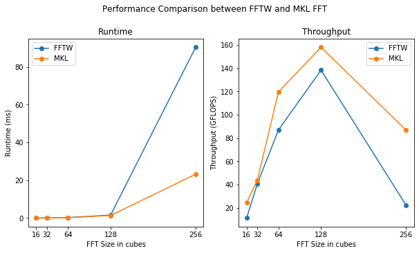

# FFT3d Library Comparison

This repository contains implementations of different FFT libraries in
order to compare their performance with the FPGA implementation.

## Libraries 
These libraries are self composed within their respective folders. The READMEs
to configure and execute them are also available.

1. FFTW
2. MKL FFT

### Configurations
Different configurations when using the code:

- FFT3d sizes
- Forward / Backward FFT
- Precision of floating point numbers : single precision, double precision
- Single Threaded, multi threaded using OpenMP

### Metrics measured

- Runtime (milliseconds)
- Throughput (GFLOPS)

## Performance

### Runtime Comparison

Runtime is reported in milliseconds.

| FFT3d Size |   FFTW   |    MKL   | FPGA Best Case |  FPGA Obtained |
|:----------:|:--------:|:--------:|:--------------:|:--------------:|
|     16     |   0.022  |  0.012   |    0.001       |     0.11       |
|     32     |   0.060  |  0.056   |    0.01        |     0.22       |
|     64     |   0.270  |  0.197   |    0.1         |     0.74       |
|     128    |   1.591  |  1.393   |    0.8         |                |
|     256    |  90.415  |  23.19   |    6.9         |                |

### Throughput Comparison

Throughput is reported in GFLOPS.

| FFT3d Size |   FFTW   |    MKL   |
|:----------:|:--------:|:--------:|
|     16     |   11.13  |  19.25   |
|     32     |   40.56  |  43.58   |
|     64     |   87.09  | 119.80   |
|     128    |  138.39  | 158.08   |
|     256    |   22.26  |  86.80   |

### Experimental Setup

#### CPU used 

2x Intel Xeon Gold "Skylake" 6148, 2.4 GHz, 40 cores

Cache Hierarchy:

- L0, L1I (32KB), L1D (32KB) private per core.
- L2 private - 1MB/core
- L3 non inclusive - 1.375 MB/core or 27.5 MB per CPU

## Analysis

Reason for loss in performance when scaling from 128 to 256 cube FFT - 128 cube requires only 2MB of memory whereas 256 cube FFT uses 128 MB of memory. The latter cannot be stored in the L3 cache, which has only 27.5 MB of memory per CPU. Thereby, the loss in performance.

#### Justifying the performance loss using FFT and cache sizes

To clearly understand if the loss in performance is due to cache misses, one can estimate the maximum FFT size that can fit into the L3 cache and obtain its performance. Then, calculate the performance of the FFT that is just larger than the cache.

- In this case, FFT size `153^3` should completely fit into 1 L3 cache but has a best performance of 28GFLOPS, whereas `154^3` which shouldn't, has a performance of 105GFLOPS.

Perhaps, FFT sizes that are powers of 2 could justify performance as the implementations of other FFT configurations could vary.

1. FFT Size `128 * 128 * 256` is larger than 1 L3 cache of the 2 in the node and has the best throughput of approximately 100 GFLOPS. Considering the L3 caches are non-inclusive and cache coherent, this should provide enough memory for the FFT to be stored in both caches, but the performance is lowered due to NUMA latency and cache coherency.

2. FFT size `128 * 256 * 256` is however, larger than the total L3 cache size but performs close to 75 GFLOPS as compared to `256 * 128 * 256`, which has a throughput of 25 GFLOPS but are identical in the number of points.

This makes it difficult to create a coherent reason to justify performance by correlating FFT sizes and cache due to possible differences in FFTW implementations and plans.
